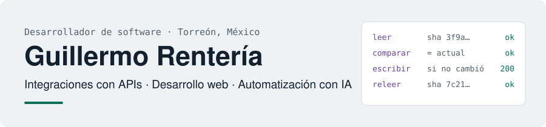

<picture>
  <source media="(prefers-color-scheme: dark)" srcset="assets/header-dark.svg">
  
</picture>

**[Portafolio](https://renteriah.github.io/)** · [English](https://renteriah.github.io/en/) · [CV (PDF)](https://renteriah.github.io/cv/) · [LinkedIn](https://www.linkedin.com/in/guillermo-renteria-9263052a6/) · [renteg18@gmail.com](mailto:renteg18@gmail.com)

Desarrollador de software y estudiante de Ingeniería en Sistemas Computacionales en el Instituto Tecnológico de La Laguna.
Hago **frontend**, **integración de APIs REST y GraphQL**, **backend** y **pruebas automatizadas**. Trabajo con agentes de IA
y reviso y verifico cada cambio; en cada proyecto indico qué parte escribieron ellos.

Software developer — frontend, REST and GraphQL APIs, backend and automated testing. Portfolio in English: [renteriah.github.io/en](https://renteriah.github.io/en/).

## Experiencia

**Desarrollador de software · Residencia profesional** — MAHA Home de México 
Torreón, Coahuila · Presencial · jul 2026 – actualidad

- Componentes y funcionalidades para páginas de producto y carrito de una tienda **Shopify Plus** en producción (Liquid, HTML, CSS, JavaScript).
- Integración y consumo de las **APIs REST y GraphQL** de Shopify, incluidas operaciones masivas.
- Modelado de datos de producto con metacampos y metaobjetos.
- Rendimiento web medido con Core Web Vitals y pruebas visuales automatizadas con Node.js y Playwright.

## Proyectos

**Código público**

- **[GYMWARRIOR](https://github.com/RenteriaH/GYMWARRIOR)** — tienda en PHP y MySQL saneada: consultas preparadas, CSRF, subidas validadas y compra en transacción. 13 pruebas e2e (10 fallaban en el original). PHP · MySQL · Playwright · [caso de estudio](https://renteriah.github.io/casos/saneamiento-gymwarrior/)
- **[Portafolio](https://github.com/RenteriaH/RenteriaH.github.io)** — sitio bilingüe en Astro con pruebas de contenido, e2e en tres anchos y CI. Lighthouse 100 en accesibilidad y SEO. Astro · TypeScript · Vitest
- **[Cliente Android de Spotify](https://github.com/RenteriaH/Spotify-API-Public)** — app en Kotlin y Jetpack Compose con 28 endpoints de la Web API, OAuth con renovación del token y reproducción. Kotlin · Compose · Retrofit · Hilt
- **[Simulador de carreras 2D](https://github.com/RenteriaH/VIDEOGAME_CARRERA)** — pistas generadas a partir de imágenes, colisiones por máscara y sensores de distancia. Python · pygame · NumPy

**Privados** — descritos en el [portafolio](https://renteriah.github.io/#trabajo), sin código ni detalles internos

- **QCE** — motor de datos de mercado en tiempo real con aprobación humana. Python · WebSockets · DuckDB
- **EcomOS** — operación de e-commerce con integraciones detrás de puertas de escritura. Python · FastAPI · Node.js

## Tecnologías

**En producción:** JavaScript · HTML · CSS · Shopify Liquid · Node.js · GraphQL · REST · Playwright 
**Proyectos propios:** Python · FastAPI · TypeScript · React · Astro · Docker · Linux · GitHub Actions 
**Formación:** PHP · MySQL · Kotlin · Java · Swift

---

Torreón, Coahuila, México · Busco un primer puesto como desarrollador de software: presencial en La Laguna, híbrido o remoto.
